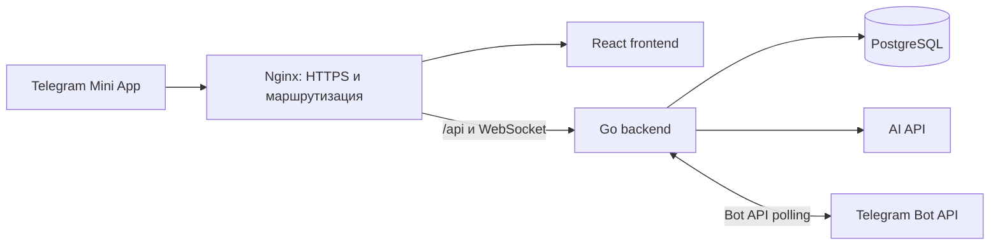

# Daily Energy

**Telegram Mini App для привычек, питания и активности.** Daily Energy помогает вести дневник, отслеживать прогресс и получать персональные рекомендации от AI-помощника.

Пользователь открывает приложение прямо в Telegram. Профиль, записи и планы хранятся в PostgreSQL, а AI-функции работают через настроенный API, совместимый с OpenAI Chat Completions.

## Возможности

- Профиль и пошаговая первичная настройка.
- Дневник питания и физической активности.
- AI-оценка калорий для еды и активности.
- Персональные планы питания и тренировок на 7 дней.
- История записей и просмотр планов по датам.
- Чат с AI-помощником Рафиком.
- Авторизация через подписанные Telegram `initData`.

AI-функции требуют действующий API-ключ. Приложение не подменяет ответы backend или AI тестовыми данными.

## Как устроено приложение



| Компонент | Роль |
| --- | --- |
| `frontend-prod` | Telegram Mini App: интерфейс, дневник, планы, профиль и чат. |
| `backend-prod` | HTTP API, проверка Telegram-авторизации, бизнес-логика и бот. |
| `postgres` | Хранение профилей, записей, планов и истории веса. |
| `nginx-prod` | HTTPS, раздача frontend, маршрутизация API и WebSocket, ограничение частоты запросов. |
| `certbot` | Выпуск и продление TLS-сертификата Let's Encrypt. |

## Технологии

- **Frontend:** React 18, TypeScript, Vite, React Router, TanStack Query, Tailwind CSS.
- **Backend:** Go 1.23, Gin, GORM, Gorilla WebSocket.
- **Данные:** PostgreSQL 17.
- **Инфраструктура:** Docker Compose, Nginx, Let's Encrypt.
- **AI:** API, совместимый с OpenAI Chat Completions; по умолчанию — OpenRouter.
- **Telegram:** Mini Apps API и Telegram Bot API с long polling.

## Структура репозитория

```text
backend/
  cmd/                  Точка входа приложения
  config/               Конфигурация и промпты
  bot/                  Telegram-бот
  internal/
    domain/             Доменные модели и порты
    app/usecase/        Сценарии приложения
    adapters/           PostgreSQL, репозитории и HTTP-маршрутизация
    interfaces/http/    Обработчики, DTO и middleware
  api/openapi/          OpenAPI-схема
frontend/
  src/app/              Корневое приложение и маршруты
  src/features/         Функциональные экраны Mini App
  src/api/              HTTP-клиент и API-функции
  src/hooks/            React hooks
  src/ui/               Общие UI-компоненты
nginx/                  Production-конфигурация Nginx
scripts/                Скрипты подготовки окружения
```

Backend следует слоистой архитектуре: домен и порты → use case → адаптеры и HTTP-интерфейсы. Это помогает держать бизнес-правила отдельно от транспорта и базы данных.

## Запуск production-окружения

### Требования

- Docker Engine и Docker Compose v2.
- Домен, направленный DNS-записью на сервер.
- Открытые TCP-порты `80` и `443`.
- Токен Telegram-бота и ключ выбранного AI API.

### Настройка и запуск

1. Создайте файл окружения из шаблона:

   ```bash
   make configure-prod
   ```

2. Заполните `.env`. Конфигуратор создаёт файл только при его отсутствии и не перезаписывает существующие настройки и секреты.
3. Запустите стек:

   ```bash
   make up
   ```

`make up` последовательно собирает backend и frontend, затем запускает сервисы в Docker Compose. Nginx обслуживает HTTPS; при первом запуске Certbot получает сертификат, затем продлевает его автоматически.

После настройки домена:

- Mini App: `https://<ваш-домен>/`
- API: `https://<ваш-домен>/api`
- Swagger UI: `https://<ваш-домен>/api/docs`
- OpenAPI-схема: `https://<ваш-домен>/api/openapi.yml`

### Настройка Telegram

1. Создайте бота через [@BotFather](https://t.me/BotFather) и задайте токен в `TELEGRAM_BOT_TOKEN`.
2. В **Bot Settings → Configure Mini App** укажите публичный HTTPS URL приложения.
3. Укажите этот же адрес в `MINI_APP_URL`.
4. Запустите стек и откройте Mini App из Telegram.

Backend устанавливает кнопку меню бота и отправляет кнопку запуска Mini App в ответ на сообщение. Telegram передаёт подписанные `initData`; backend проверяет их подлинность. Поэтому API-запросы из обычного браузера без Telegram-сессии ожидаемо получают `401`.

## Конфигурация

Полный шаблон находится в [`.env.example`](.env.example). Основные переменные:

| Переменная | Назначение |
| --- | --- |
| `DB_USERNAME`, `DB_PASSWORD`, `DB_NAME` | Учётные данные PostgreSQL. `DB_HOST` и `DB_PORT` для production задаёт Compose. |
| `TELEGRAM_BOT_TOKEN` | Токен бота; нужен для Telegram Bot API и проверки `initData`. |
| `MINI_APP_URL` | Полный HTTPS URL Mini App, например `https://app.example.com/`. |
| `API_PATH` | URL AI endpoint, совместимого с OpenAI Chat Completions API. |
| `API_KEY` | Ключ доступа к AI API. Не публикуйте и не коммитьте его. |
| `ALLOW_ORIGINS` | Разрешённые frontend origins через запятую. Если не задано, используется origin из `MINI_APP_URL`. |
| `SERVER_NAME` | Домен для Nginx и Certbot, только hostname: `app.example.com`. |
| `CERTBOT_EMAIL` | Email для регистрации сертификата Let's Encrypt. |
| `TAG` | Тег Docker-образов; по умолчанию `latest`. |
| `VITE_API_URL` | Необязательное переопределение API URL при сборке frontend. Пустое значение использует текущий origin. |

## API и безопасность

- API зарегистрирован под `/api`; интерактивная документация доступна по `/api/docs`.
- Пользовательские endpoints проверяют подпись Telegram `initData` middleware-ом.
- Чат использует WebSocket endpoint `/api/ws/chat`.
- Nginx завершает TLS, сжимает текстовые ответы и ограничивает частоту API, AI и WebSocket handshake запросов.
- Если перед Nginx стоит proxy или CDN, настройте доверенные адреса и передачу реального IP отдельно.

## Управление сервисами

| Команда | Действие |
| --- | --- |
| `make up` | Собрать образы и запустить production-стек. |
| `make ps` | Показать состояние сервисов. |
| `make logs` | Следить за логами. |
| `make restart` | Перезапустить сервисы. |
| `make stop` | Остановить сервисы, сохранив данные. |
| `make down` | Остановить Compose и удалить volumes, включая данные PostgreSQL. |
| `make configure-prod` | Создать `.env` из шаблона, если файла ещё нет. |

Для Windows с Docker Desktop используйте `.\scripts\configure.ps1 -Up` в PowerShell. Скрипт поддерживает также `-Stop`, `-Down` и `-Logs`. В WSL доступны команды `make`.

## Сборка и проверки

- Production: `make build` собирает Docker-образы; `make up` собирает их и запускает стек.
- Frontend: `cd frontend && npm run lint && npm run build`.
- Backend: `cd backend && go test ./...`.
